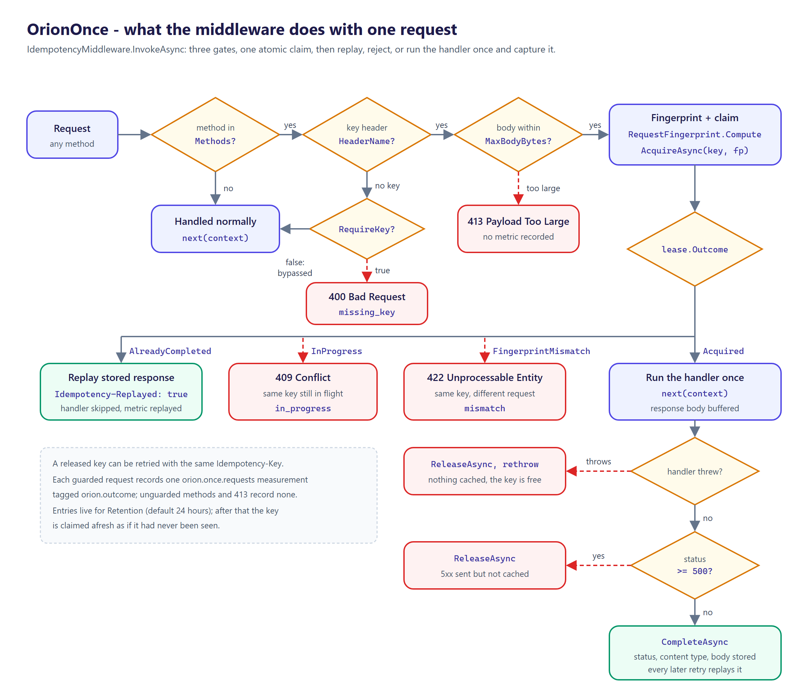
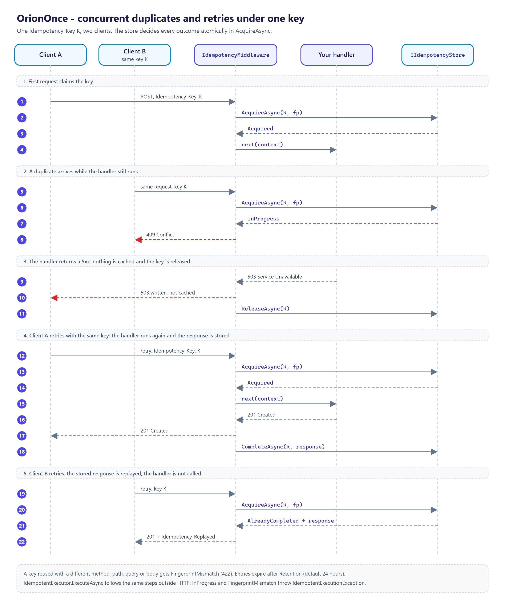

# OrionOnce features

A deep breakdown of what OrionOnce does and how each piece behaves. Everything here reflects the
`0.4.0` public surface in `src/Moongazing.OrionOnce` (package `OrionOnce`) and
`src/Moongazing.OrionOnce.EntityFrameworkCore` (package `OrionOnce.EntityFrameworkCore`).

## The idempotency middleware

`IdempotencyMiddleware` (registered through `UseOrionOnce()`) is the entry point. For each request
it runs the following decision flow:

1. **Method gate.** If the request method is not in `IdempotencyOptions.Methods` (by default only
   `POST`, `PUT`, `PATCH`, `DELETE`), the middleware calls the next delegate and returns. Safe
   methods are never buffered or fingerprinted.
2. **Key extraction.** It reads the header named by `IdempotencyOptions.HeaderName`
   (default `Idempotency-Key`). A missing or whitespace-only value means "no key".
   - With `RequireKey = true`, a guarded request with no key is rejected `400 Bad Request`
     (outcome `missing_key`) and the handler never runs.
   - With `RequireKey = false` (the default), the request bypasses idempotency and is handled
     normally (outcome `bypassed`).
3. **Body buffering.** The request body is read into memory with `EnableBuffering`, capped at
   `MaxBodyBytes`. If the body exceeds the cap, the request is rejected `413 Payload Too Large`
   before any handler work. The buffered body is rewound so the handler can re-read it.
4. **Fingerprint + claim.** It computes the request fingerprint and calls
   `IIdempotencyStore.AcquireAsync(key, fingerprint)`. The returned lease drives the outcome:
   - `Acquired`: the handler runs once and its response is captured (see below).
   - `AlreadyCompleted`: the stored response is replayed with `Idempotency-Replayed: true`; the
     handler is skipped.
   - `InProgress`: a concurrent request already holds the key, so this one is rejected
     `409 Conflict`.
   - `FingerprintMismatch`: the key was used before with a different request, so this one is
     rejected `422 Unprocessable Entity`.

### Response capture

When a key is acquired, the middleware swaps the response body for a `MemoryStream`, runs the
handler, and then writes the captured bytes back to the real response stream. After the handler
completes:

- **Handler throws.** The original response stream is restored, the key is released via
  `ReleaseAsync`, and the exception is rethrown. Nothing is cached, so a retry re-runs the handler.
- **Handler returns `5xx`.** A `500`-or-greater status is treated as transient: the key is released
  and the response is not cached, so the same key can be retried.
- **Handler returns `<500`.** The status code, content type, and body are stored via
  `CompleteAsync` as a `CachedResponse`, ready to replay on the next request with the same key.

In both non-throwing cases the captured body is written to the client before the store call.

### What is replayed

A replay reproduces the original **status code**, **content type**, and **body** and adds the
`Idempotency-Replayed: true` header (`IdempotencyMiddleware.ReplayedHeader`). Other response
headers from the first call are intentionally **not** captured or replayed in this version.

## Request fingerprint

`RequestFingerprint.Compute(method, path, body)` is a pure static helper:

- Hashes the uppercased method, a newline, the path (the middleware passes path plus query string),
  another newline, and the raw body bytes.
- Returns a 64-character lowercase hex SHA-256 digest.
- Binds a key to a specific request so reusing a key for a different body or route is detectable.

Because the path is combined with the query string by the middleware, the same key used against
two different query strings is treated as a mismatch.

## Options

`IdempotencyOptions` is validated when `AddOrionOnce` runs (`HeaderName` non-empty; `Retention` and
`MaxBodyBytes` positive). Invalid options throw at startup rather than at request time.

| Option | Default | Notes |
|--------|---------|-------|
| `HeaderName` | `Idempotency-Key` | The request header that carries the key |
| `Retention` | `TimeSpan.FromHours(24)` | Retention window passed to the in-memory store |
| `Methods` | `POST`, `PUT`, `PATCH`, `DELETE` | A mutable case-insensitive set you can add to or clear |
| `RequireKey` | `false` | Whether a guarded request must carry a key |
| `MaxBodyBytes` | `1024 * 1024` (1 MiB) | Body size cap for buffering and fingerprinting |

## Idempotent execution outside HTTP

`IdempotentExecutor` applies the same claim-and-replay protocol to any operation, over the same
`IIdempotencyStore`:

- `ExecuteAsync<TResult>(key, fingerprint, operation, codec, cancellationToken)` calls
  `AcquireAsync(key, fingerprint)`. `AlreadyCompleted` deserializes the stored body with the codec and
  returns it without running the operation. `InProgress` and `FingerprintMismatch` throw
  `IdempotentExecutionException`, whose `Outcome` property says which. `Acquired` runs the operation,
  serializes its result with the codec and stores it via `CompleteAsync` (status `200`, the content
  type from the codec).
- If the operation throws, or serialization or `CompleteAsync` fails, the key is released and the
  original exception propagates. That release uses `CancellationToken.None` and swallows its own
  faults, so it runs even when the caller's token is already canceled.
- The library ships no serializer. `IIdempotentResultCodec<TResult>` has `ContentType`,
  `Serialize(TResult)` (returning `ReadOnlyMemory<byte>`) and `Deserialize(ReadOnlySpan<byte>)`;
  `DelegateResultCodec<TResult>` wraps a serialize and a deserialize delegate.
- `IdempotentExecutor` records no metrics.

The fingerprint is any stable string for the operation; `RequestFingerprint.Compute` works for
non-HTTP input too (for example `Compute("charge", orderId, payload)`).

## Storage contract

`IIdempotencyStore` has four methods, all cancellable:

- `Task<IdempotencyLease> AcquireAsync(string key, string fingerprint, CancellationToken)` —
  atomically claim a key or report `AlreadyCompleted`, `InProgress`, or `FingerprintMismatch`.
  **This must be atomic**: two concurrent callers with the same key must not both receive
  `Acquired`.
- `Task CompleteAsync(string key, CachedResponse response, CancellationToken)` — store the response
  for a previously acquired key so later requests replay it.
- `Task ReleaseAsync(string key, CancellationToken)` — drop a still-in-progress claim that could not
  be completed, so the request can be retried.
- `Task<int> SweepAsync(CancellationToken)` — remove every entry whose retention window has elapsed
  and return how many were removed. It has a default interface implementation that does nothing and
  returns `0`, for stores (for example Redis) that expire entries themselves.

`IdempotencyLease` exposes the `Outcome` (an `IdempotencyOutcome` enum) and, for
`AlreadyCompleted`, the `CachedResponse` to replay. `CachedResponse` carries the `StatusCode`
(required), `ContentType` (nullable), and `Body` (a `ReadOnlyMemory<byte>`, required).

### InMemoryIdempotencyStore

The default store is process-local and backed by a `Dictionary`:

- A single `lock` guards the claim/complete/release critical sections, providing the required
  atomicity on one instance.
- Entries carry an expiry derived from the configured TTL (`AddOrionOnce` passes `Retention`);
  an expired entry is treated as absent on access, and `SweepAsync` removes every expired entry in
  one pass. `CompleteAsync` restarts the window from the completion time.
- The clock is `TimeProvider.System` by default; `InMemoryIdempotencyStore(TimeSpan, TimeProvider)`
  takes a fake clock for tests.
- `ReleaseAsync` only removes a still-in-progress entry; it never discards an already-cached
  response.

It is correct for a single instance or for tests. For a multi-instance deployment, use the EF Core
store below or implement `IIdempotencyStore` over a shared backend and register it before or after
`AddOrionOnce()`; the in-memory store is only added when no `IIdempotencyStore` is registered.

### EntityFrameworkCoreIdempotencyStore

`OrionOnce.EntityFrameworkCore` provides `EntityFrameworkCoreIdempotencyStore<TContext>`, a durable
store over EF Core that creates a short-lived context per call from an `IDbContextFactory<TContext>`.

- **Schema.** `IdempotencyEntryConfiguration` maps `IdempotencyEntry` to the table
  `OrionOnceIdempotencyEntries` (or a name passed to its constructor): `Key` is the primary key
  (max length 256), `Fingerprint` is required (max length 256), plus `IsCompleted`, `StatusCode`,
  `ContentType`, `Body` and `ExpiresAtTicks`, which is indexed. `OrionOnceDbContext` applies it; apply
  it to your own context to fold the table in. The store does not create the table; add a migration.
- **Claim.** `AcquireAsync` inserts the row (or reclaims an expired one in place). A concurrent
  insert of the same key fails on the primary key; the store then re-reads the row on a clean context
  and reports the state of the winner (`InProgress`, `AlreadyCompleted` or `FingerprintMismatch`). If
  no row is there, the failure was something else and it is surfaced instead of being reported as a
  conflict.
- **Expired-row reclaim is not atomic.** Reclaiming an expired row is an ordinary `UPDATE` with no
  concurrency token and no expiry predicate, so two callers that read the same expired row at the
  same moment both save and both get `Acquired`. The primary key protects only concurrent inserts.
  Running `SweepAsync` often narrows the window, because a swept key is claimed by insert again.
- **Release and sweep.** `ReleaseAsync` deletes the row only while it is not completed. `SweepAsync`
  bulk-deletes rows with `ExpiresAtTicks <= now` through `ExecuteDeleteAsync`.
- **Registration.** `AddOrionOnceEntityFrameworkCoreStore(configureDbContext, retention)` registers
  `IDbContextFactory<OrionOnceDbContext>` and the store; the generic overload
  `AddOrionOnceEntityFrameworkCoreStore<TContext>(...)` uses your context. The store replaces the
  in-memory default whichever order the two calls run in. Its TTL is `retention` when given,
  otherwise `IdempotencyOptions.Retention`; its clock is the registered `TimeProvider`, or the system
  clock.
- The package references `Microsoft.EntityFrameworkCore.Relational` only, one EF Core major per target
  framework (`8.0.x`, `9.0.x`, `10.0.x`), so the application chooses the provider.

## Diagnostics

`IdempotencyDiagnostics` owns a `System.Diagnostics.Metrics.Meter` named `Moongazing.OrionOnce`
(`IdempotencyDiagnostics.MeterName`) and a single counter `orion.once.requests` (unit `{request}`),
tagged `orion.outcome`. It derives from `OrionInstrumentation` in `Orion.Abstractions`, so static tags
set with `OrionInstrumentation.SetStaticTags` are added to every measurement. Every guarded request
records exactly one outcome; unguarded methods and a request rejected `413` record none:

| Outcome tag | Meaning |
|-------------|---------|
| `acquired` | Key claimed; handler ran and the response was captured |
| `replayed` | Stored response replayed for a repeated key |
| `in_progress` | Duplicate rejected `409` while the first request was in flight |
| `mismatch` | Key reused with a different request, rejected `422` |
| `missing_key` | Guarded request without a key while `RequireKey = true`, rejected `400` |
| `bypassed` | Guarded request without a key while `RequireKey = false` |

The diagnostics object is registered as a singleton and disposes its meter on shutdown.

## Registration

`AddOrionOnce(this IServiceCollection, Action<IdempotencyOptions>?)`:

- Builds and validates the options, then registers them as a singleton (an invalid value throws
  `ArgumentException` or `ArgumentOutOfRangeException` inside the call).
- Registers `IdempotencyDiagnostics` as a singleton (via `TryAddSingleton`).
- Registers `InMemoryIdempotencyStore` as the `IIdempotencyStore` **only if one is not already
  registered** (via `TryAddSingleton`), so a custom store always wins.

`UseOrionOnce(this IApplicationBuilder)` adds `IdempotencyMiddleware` to the pipeline. Place it
after routing and before the endpoints whose retries you want to deduplicate.

## Targeting

The library multi-targets `net8.0`, `net9.0`, and `net10.0`, with nullable reference types enabled,
implicit usings, and `TreatWarningsAsErrors`.
